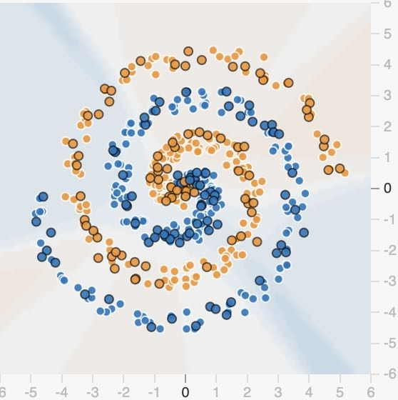
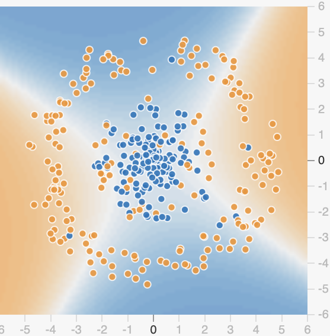
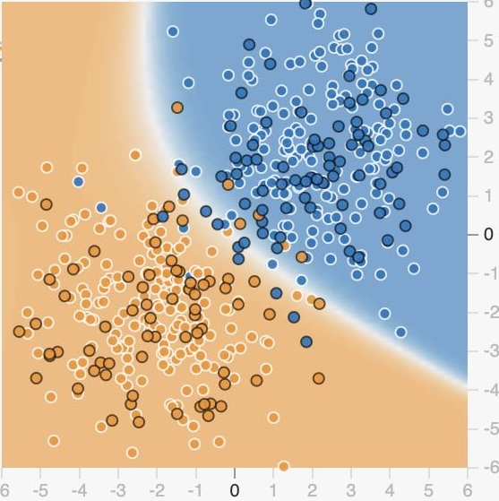

```{r setup, echo=FALSE}
knitr::opts_chunk$set(echo = FALSE)
```

::: {.solbox data-latex=""}
```{r}
nn.data <- read.csv("nn-stat404.txt", sep="")
```
:::

# Abstract
This study investigates the effects of different activation functions (`ReLU, Tanh, Sigmoid,` and `Linear`) and learning rates (`low - 0.001, medium - 0.003` and `high - 0.01`) on the ability of a neural network to learn non-linear data patterns. The experiment involves generation of synthetic datasets featuring various geometric patterns like `spiral`, `concentric`, and `Gaussian` for binary classification tasks using neural networks. The testing loss, representing the mean squared error, was assessed across 36 treatment and blocking combinations. The experiment employs a factorial design and uses ANOVA with contrasts to analyze the main effects and interactions to identify significant factors influencing performance. Results suggest that ... activation with ... learning rates achieves optimal performance across patterns, though significant interactions highlight pattern-specific considerations.

# Introduction
The use of neural networks in classifying complex, non-linear data patterns is a central challenge in machine learning. This experiment explores how different activation functions and learning rates affect a neural network's ability to accurately classify such patterns. Specifically, we aim to determine the optimal hyper-parameters for training a neural network with fixed architecture and its implications for learning efficiency. 

The report is structured as follows: **Section 2** describes the experimental design, **Section 3** outlines the statistical analysis, and **Section 4** presents the conclusions.

# Details of the Experimental Design

## Factors and Levels

| Factor               | Description                                   | Levels                     |
|----------------------|-----------------------------------------------|----------------------------|
| **Activation Function** | Non-linearity handling functions at each node | ReLU, Tanh, Sigmoid Linear |
| **Learning Rate**     | Rate at which model weights are updated       | Low (0.001), Medium (0.005), High (0.01) |
| **Data Patterns**     | Types of patterns used for classification     | Spiral, Gaussian Mixture, Concentric Circles |

## Experimental Plan

The experiment involves a fully connected neural network with 4-8-4 neurons in a hidden layer configuration. The network uses a sigmoid activation function in the output layer for binary classification. The data features used for training the neural network include `X_1`, `X_2`, `X_1^2`, `X_2^2`, and `X_1 * X_2` (interaction term). A 70-30 data split is used, where 30% of the data is used for testing. The neural network is trained for 100 epochs, and the test error (misclassification error) is calculated after each epoch. The goal is to analyze the impact of different treatment combinations (activation function, learning rate, and data pattern) on the test error.

## Randomization and Blocking

Randomization is applied to the treatment combinations to avoid bias. Data patterns serve as the blocking factor, ensuring that observed variations in the test error are not confounded by the complexity of the patterns themselves. The randomization of treatment combinations across runs ensures that results are not influenced by the order of the treatments.


# Statistical analysis
```{r}
nn.data$pattern <- as.factor(nn.data$pattern)
nn.data$activation <- as.factor(nn.data$activation)
nn.data$learning.rate <- as.factor(nn.data$learning.rate)

str(nn.data)

```
```{r}
library(MASS)
# Perform ANOVA to analyze the impact of the factors on the test error
anova_results <- aov(10*test.error ~ pattern * activation + activation*learning.rate+ learning.rate*pattern, data = nn.data)

summary(anova_results)

boxcox(aov(10*test.error ~ pattern,data=nn.data))
boxcox(anova_results) 
```

```{r}
# Check for normality of residuals using a Q-Q plot
qqnorm(residuals(anova_results))
qqline(residuals(anova_results))

```
```{r}
# Check for homogeneity of variances using a plot of residuals vs. fitted values
plot(fitted(anova_results), residuals(anova_results), 
     xlab = "Fitted Values", ylab = "Residuals")
abline(h = 0, col = "red")

```
```{r}
contrasts(nn.data$activation) <- contr.treatment(levels(nn.data$activation), base = 1) 
anova_model <- aov(test.error*10 ~ pattern * activation + activation * learning.rate + learning.rate * pattern, data = nn.data)
summary(anova_model)
```
```{r}
# Create an interaction plot using interaction.plot()
interaction.plot(x.factor = nn.data$pattern, 
                 trace.factor = nn.data$activation, 
                 response = nn.data$test.error,
                 type = "b",                  # Type of plot (both points and lines)
                 col = c("red", "green", "blue", "purple"),  # Colors for the activation levels
                 pch = c(19, 17, 15, 16),     # Different symbols for each activation function
                 xlab = "Pattern",            # Label for x-axis
                 ylab = "Test Error",         # Label for y-axis
                 main = "Interaction Plot: Pattern vs Test Error by Activation")

```

# Results and Conclusions

## Descriptive Statistics


This experiment demonstrates the influence of activation functions and learning rates on neural network performance in classifying non-linear data patterns. We found that...Future work could explore the impact of additional network architectures, optimizers, and regularization techniques to improve model performance further.


# Tables and Figures
{width=300px}
{width=300px}
{width=300px}


# Units

All values related to the model parameters (e.g., learning rates, test error) will be presented with their corresponding units. The learning rate is dimensionless, while the test error (misclassification rate) is given as a percentage.


# Data Appendix

The dataset and the R code used for the analysis will be included in the appendix. The dataset contains the features `X_1`, `X_2`, `X_1^2`, `X_2^2`, and `X_1 * X_2`, with corresponding labels for each data point. The R code for generating the synthetic datasets, training the neural network, and conducting the statistical analysis will be provided.


